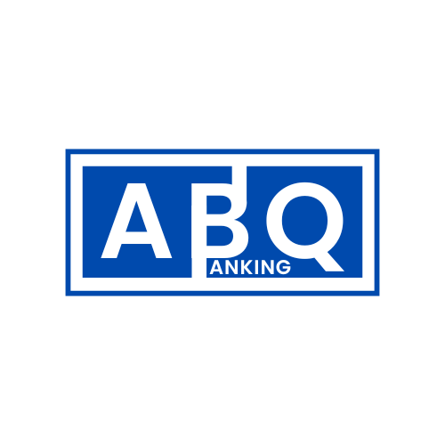

<p align="center">
  
</p>

# ABQ Banking

Une plateforme innovante pour l'optimisation des portefeuilles d'investissement et la gestion des risques. ABQ Banking offre des outils d'analyse avancée, des visualisations interactives et une surveillance en temps réel pour aider les gestionnaires d'actifs et les banques à prendre des décisions stratégiques éclairées.

---

## **Fonctionnalités Clés**

### 🎯 **Optimisation de Portefeuilles**
- Modèles d'allocation modernes : Markowitz, Black-Litterman.
- Simulation Monte Carlo pour tester des stratégies.
- Analyse des indicateurs financiers : Sharpe Ratio, Beta, Alpha.

### ⚠️ **Gestion des Risques**
- Calcul de la VaR (Value at Risk) et CVaR.
- Stress testing basé sur des scénarios.
- Détection des corrélations et expositions excessives.

### 📊 **Visualisation Dynamique**
- Tableaux de bord interactifs pour suivre performances et risques.
- Graphiques intuitifs pour une allocation efficace des actifs.

### 🔄 **Surveillance en Temps Réel**
- Intégration avec des APIs de données financières (Bloomberg, Yahoo Finance).
- Notifications instantanées en cas de dépassements de seuils.

### 📑 **Rapports Automatisés**
- Rapports détaillés exportables en PDF ou Excel.
- Conçus pour les investisseurs institutionnels et particuliers.

---

## **Technologies Utilisées**
- **Langages** : Python (Pandas, NumPy, Matplotlib), SQL.
- **Frameworks** : Flask ou Django pour le backend, React.js pour le frontend.
- **APIs** : Alpha Vantage, Yahoo Finance, Bloomberg.
- **Machine Learning** : Clustering et détection d'anomalies.

---

## **Installation**

1. Clonez ce dépôt :
   ```bash
   git clone https://github.com/votre-utilisateur/abq-banking.git
   ```
2. Installez les dépendances nécessaires :
   ```bash
   pip install -r requirements.txt
   ```
3. Lancez le serveur local :
   ```bash
   python app.py
   ```

---

## **Contribution**
Les contributions sont les bienvenues ! Veuillez ouvrir une issue pour signaler un problème ou proposer une amélioration.

---

## **Licence**
Ce projet est sous licence [MIT](LICENSE).

---

<p align="center">
  🚀 Créé avec passion par l'équipe **ABQ Banking**.
</p>
